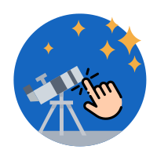
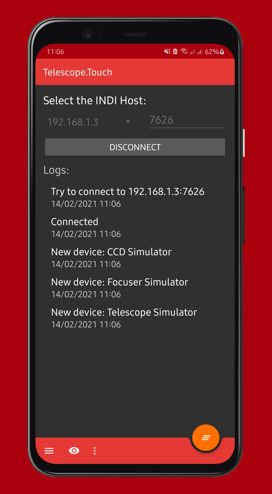
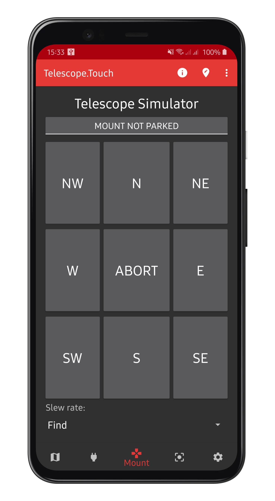
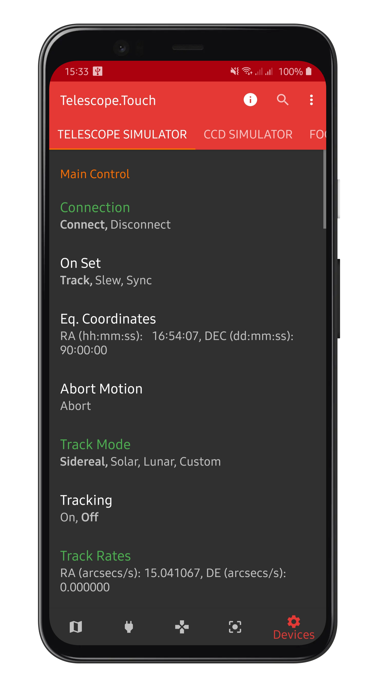

# Telescope.Touch: the definitive mobile planetarium

Telescope.Touch was born as an attempt of merging [Sky Map](https://github.com/sky-map-team/stardroid) and
[IPARCOS](https://github.com/INDIForJava/IPARCOS), an INDI client for Android. It features full telescope control
and mobile sky chart functionality, with a completely renewed user interface and base code.

The project's main page is [on GitHub](https://github.com/marcocipriani01/Telescope.Touch)

## Telescope.Touch Pro

Dear users, I've been working on Telescope.Touch "part-time" for three months straight. That is all time I took away from my hobbies and studies (I'm in university!). To support the project, I decided to create the **Telescope.Touch Pro extension pack**, which will be release on Google Play very soon. It adds some very cool features, like altitude graphs and HD previews in the Go-To database. If you want to support the development, please consider buying it. When all the development costs are covered, I'll remove the Pro version and bring all the features to the free app. If, instead, you don't want to support me, you can download the source code here, and remove the locks that prevent you from using Pro features in the free app. Just please, don't share your unlocked app.

### Donating via PayPal

If you feel extra-generous, you can also donate via PayPal. **Thank you!**

### Screenshots

## Features

- Mobile planetarium derived from the [Sky Map](https://github.com/sky-map-team/stardroid) project
- Mount and focuser controller with directional pads and speed controls
- Database full of objects to which you can point the telescope directly from the app
- INDI control panel compatible with every device
- Languages: English, Italian and French. Sky maps are translated in almost every language.

## Installing Telescope.Touch

- **From Google Play: [play.google.com/store/apps/details?id=io.github.marcocipriani01.telescopetouch](https://play.google.com/store/apps/details?id=io.github.marcocipriani01.telescopetouch)**
- From the .apk file:
  - Allow apps from unknown sources in the Android settings (Settings → Security → Unknown sources)
  - Download and install the latest release from GitHub
- Minimum Android version: 5.0

## Telescope control usage

1. Prerequisite
  - An INDI server must be running on the remote computer.
  - You must have network access to the server. 
    - To achieve this, the Android device and the remote computer can be placed on your home network.
    - Alternatively, you can create a wireless network with your Android device and connect the remote computer to this network.
2. Connection:
  - Choose the server address in the list or press on "Add server" to add a new server in the list
  - Optionally, you can change the port number if you do not use the default value for the INDI protocol (7624)
  - Click on "Connect"
3. INDI control panel:
  - Click on the gear icon in the navigation bar to display the control panel.
  - Use the tabs to switch between the devices.
  - The properties of the device are displayed in a list. Click on a property to edit it or show the details.
4. Telescope motion:
  - Press the joystick icon to display the telescope motion control panel.
  - The buttons will be enabled or disabled depending on the devices features.
  - If the device is not connected, the properties may not appear and the buttons will be disabled.
  - Go-to database can be viewed by pressing on the toolbar icon.
5. Focuser control:
  - Supports speed control, focus in/out and absolute position;

## Sky Map feature

You can access the sky map by pressing on the map icon in the navigation bar. There, you'll find all the usual Sky Map features
with a renewed user interface and high-definition planet thumbnails.

## Developed by

- **Marco Cipriani** (@marcocipriani01): main developer
- **Romain Fafet** (@farom57): [IPARCOS](https://github.com/INDIForJava/IPARCOS) codebase
- **Sky Map team**: [Sky Map](https://github.com/sky-map-team/stardroid) codebase

### Contributors

- Valentin Chevalier, for the French translation and his support
- theChef613 for his help in bringing the app to the Google Play Store

### Libraries and credits

- The [IPARCOS](https://github.com/INDIForJava/IPARCOS) project, GPL v3 license
- The [Sky Map](https://github.com/sky-map-team/stardroid) project, Apache 2.0 license
- [INDIForJava](https://github.com/INDIForJava/INDIForJava), LGPL v3 license
- [Material icons](https://material.io/resources/icons/), Apache 2.0 license
- [Telescope icon](https://www.flaticon.com/free-icon/telescope_1086070?term=telescope&page=1&position=81&related_item_id=1086070), Flaticon License
- [Touch icon](https://www.flaticon.com/free-icon/touch_941563?term=touch&page=1&position=6&related_item_id=941563), Flaticon License
- [Compass by iutinvg](https://github.com/iutinvg/compass), MIT License

The licenses for each software library used in the project can be found in the app (About this app > menu > Open-source Licenses)
